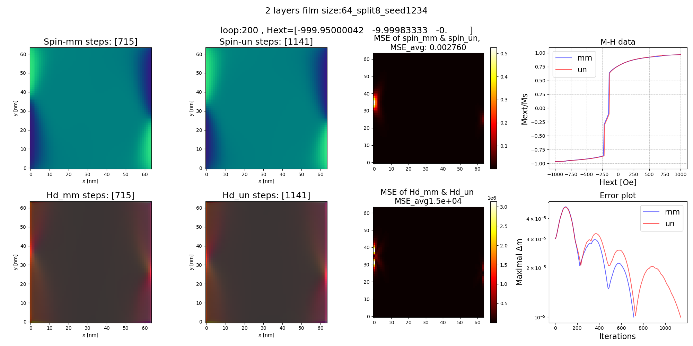

<div align="center">
  
</div>


## Introduction to NeuralMAG Project

The NeuralMAG Project is an open-source neural network framework designed for micromagnetic simulation. It employs a multi-scale U-Net neural network model to learn the physical relationship between magnetization states and demagnetizing fields, effectively extending traditional micromagnetic simulations into the realm of advanced deep learning frameworks. This approach fully leverages the cutting-edge technologies available on deep learning platforms.

<div align="center">
<figure>
    
</figure>
</div>


The project finds wide application in the study of magnetic materials among other areas.

## Capabilities of NeuralMAG

- **Integration with PyTorch Platform**: NeuralMAG integrates MAG micromagnetic simulations into the PyTorch framework, utilizing the extensive parallelization capabilities of GPUs for enhanced performance.
- **Cross-Scale Neural Network Simulation**: By employing a multi-scale Unet neural network architecture, the system can efficiently simulate magnetic material systems on a large scale.
- **Generalization Across Material Systems**: The model has been designed to generalize effectively to previously unseen material systems, thereby broadening the scope for exploration of new materials.
- **Versatility in Micromagnetic Simulation Tasks**: NeuralMAG is adept at performing a wide array of micromagnetic simulations, including but not limited to predicting magnetic ground states, simulating hysteresis loops, and accommodating arbitrary geometric shapes in simulations.
- **Utilization of Advanced Deep Learning Optimization Techniques**: The framework incorporates the latest advancements in model compression and acceleration optimization technologies that are prevalent in modern deep learning platforms.


## Getting Started

### Installation Requirements

Hardware requirements
- **GPU**: Nvidia RTX-3090

Ensure your system meets the following prerequisites:
- **Linux**: Ubuntu 20.04.6, Ubuntu 22.04
- **Python Version**: 3.9.0
- **PyTorch Version**: 2.0.1 with CUDA 11.7 support
- **Additional Dependencies**: For a complete list of required libraries and their versions, refer to the [`requirements.txt`](./requirements.txt) file.

### Usage Instructions

#### Example Tasks (`./egs`)

This directory houses sample tasks, including:
- **NMI**: Replicates the main experimental results presented in the manuscript.
- **Demo**: Contains code for quick experimentation and familiarization with the tool. 
- **Checkpoint**: Pre-trained Unet model parameters used in the manuscript are located in [`Checkpoint`](./egs/NMI/ckpt/k16)

#### Libraries (`./libs`)

Contains the core libraries of the project:
- Traditional micromagnetic simulation frameworks based on RK4 and LLG equations[`MAG2305`](./libs/MAG2305.py).
- Unet neural network model architecture[`Unet`](./libs/Unet.py).
- Auxiliary functions pertinent to this project[`misc`](./libs/misc.py).

#### Utilities (`./utils`)

This directory includes scripts for data generation, essential for training the Unet model:
- Scripts generate the Magnetic spin & Demagnetizing field data pairs \( \vec{m}, H_{\text{demag}} \) required for Unet training.

By following these instructions, users can set up the necessary environment to run simulations, replicate study findings, or train the Unet model with custom data.


## Example Execution

### Running MH Simulations

#### Quick Trial

To expediently initiate the simulation of the MH curve for magnetic thin film materials, such as a material configured into a triangular shape with a dual-layer thickness, characterized by magnetic properties delineated by `{ --Ms 1000, --Ax 0.5e-6, --Ku 0.0 }`, please execute the following script:

```bash
./egs/demo/MH/runMH.sh
```

This script facilitates a comparative analysis of outcomes derived from FFT-based and Unet-based micromagnetic simulation frameworks.


#### Replication of Published Results

To replicate the MH experimental results detailed in the manuscript, please use the following script:

```bash
./egs/NMI/MH_evaluate/runMH.sh
```

This script facilitates the adjustment of the film's dimensions via the `--width` parameter and is configured to test 13 unique combinations of magnetic property parameters:

- `--Ms` for saturation magnetization, with values: {1200, 1000, 800, 600, 400} (in arbitrary units),
- `--Ku` for uniaxial anisotropy constant, with values: {1e5, 2e5, 3e5, 4e5} (in arbitrary units),
- `--Ax` for exchange stiffness constant, with values: {0.7e-6, 0.6e-6, 0.4e-6, 0.3e-6} (in meters).

The `--mask` parameter specifies the shape of the magnetic film, which can include:

- Triangular films,
- Films with a central hole,
- Films of random polygonal shapes.


#### Sample: MH result Images

Triangular film MH result | Film with a central hole MH result | Random polygonal film MH result
:-------------------------:|:-----------------------------------:|:---------------------------------:
 |  | 


### Running Vortex Simulations

#### Quick Trial

To commence a micromagnetic dynamical analysis based on the LLG (Landau-Lifshitz-Gilbert) equation from a random initial condition, execute:

```bash
./egs/demo/vortex/run.sh
```

This command initiates a simulation applying FFT (Fast Fourier Transform) until the vortex count meets the `--pre_core` parameter's specification, whereupon Unet modeling commences. The `--pre_core` parameter signifies the initial vortex count for transitioning from FFT to Unet simulation.

#### Replication of Published Results

For exact replication of the manuscript's vortex simulation outcomes, utilize:

```bash
./egs/NMI/vortex_evaluate/run.sh
```

This script provides a detailed evaluation of Unet's prediction accuracy across initial vortex counts `--pre_core=5,10,20`, comparing results from 100 dynamical experiments per test condition to assess Unet's performance.

#### Sample: Vortex Simulations Result Images

Varying Materials | Random Shapes | Square Films
:-----------------------------------------:|:---------------------------------------:|:--------------------------------------:
 |  | 


### Computational Speed Assessment

To assess the computational efficiency of micromagnetic simulations within distinct frameworks, the following command is recommended:

```bash
./egs/NMI/speed_evaluate/run.sh
```

This command facilitates the setup of comparative analyses for micromagnetic films of variable dimensions through the `--width` parameter. It systematically evaluates the computational demands of three distinct simulation frameworks:

- A traditional FFT-based approach,
- The Unet framework, employing deep neural networks,
- TensorRT-accelerated Unet modeling.

This assessment elucidates the potential for efficiency gains and performance enhancements through the adoption of deep learning and acceleration technologies in micromagnetic simulation workflows.

### standproblem


### Data Generation and Model Training Process

#### Data Generation

The dataset referenced in our study is generated via:

```bash
./utils/run.sh
```

The script automatically generates datasets in four sizes: 32, 64, 96, and 128. The first three sizes are for cross-scale training, while the 128 size assesses generalization across scales. Each size's dataset is developed under three conditions: a default square shape, and two scenarios involving random shape masks for augmentation, each additionally subjected to two magnitudes of external magnetic fields. Therefore, each size features three conditions with 100 cases each, facilitating a comprehensive evaluation of the model's robustness and scalability.

For data inspection and analysis, a visualization utility is provided:

```bash
./utils/visualize_data.py
```

Executing this script produces visual representations of the dataset, showcasing magnetic vector fields, RGB imagery, and histograms of numerical statistics, thereby facilitating a comprehensive overview of the training data's characteristics.

#### Sample: Data Visualization 
Spin vector | Spins RGB | Spin histogram 
:-----------------------------------------:|:---------------------------------------:|:--------------------------------------:
 |  | 

demagnetizing field vector | demagnetizing field RGB | demagnetizing field histogram 
:-----------------------------------------:|:---------------------------------------:|:--------------------------------------:
 | | 

#### Model Training

Once the data is prepared, you can commence training your own Unet model by executing:

```bash
./egs/demo/train/run_train.sh
```

Adjust the volume of training data with `--ntrain` and set the test dataset size via `--ntest`. Training hyperparameters including `--batch-size`, `--lr` (learning rate), and `--epochs` are customizable to optimize performance, though default settings are provided to replicate manuscript results. Parameters `--kc` and `--inch`, crucial for the model's network architecture, remain fixed to preserve model dimensions. Training generates automated logs of model progress, including intermediate models, convergence metrics, and performance evaluations.

To apply the trained model to micromagnetic simulations, replace the existing model at `./egs/NMI/ckpt/k16/model.pt` with the newly trained model.

#### Sample: Model Training Visualizations
 Training loss | Input(spin) and output(Hd) data RGB | Input(spin) and output(Hd) data vector
:-----------------------------:|:-----------------------------:|:-----------------------------:
 |  | 


## Paper Citation

```

@Article{,
 AUTHOR = {, , , },
 TITLE = { },
 JOURNAL = {  },
 VOLUME = {},
 YEAR = {2024},
 NUMBER = {},
 ARTICLE-NUMBER = {},
 URL = {https://www.},
 DOI = {10.}
}

```


## License

This project is licensed under the MIT License - see the [`LICENSE`](./LICENSE) file for details.


